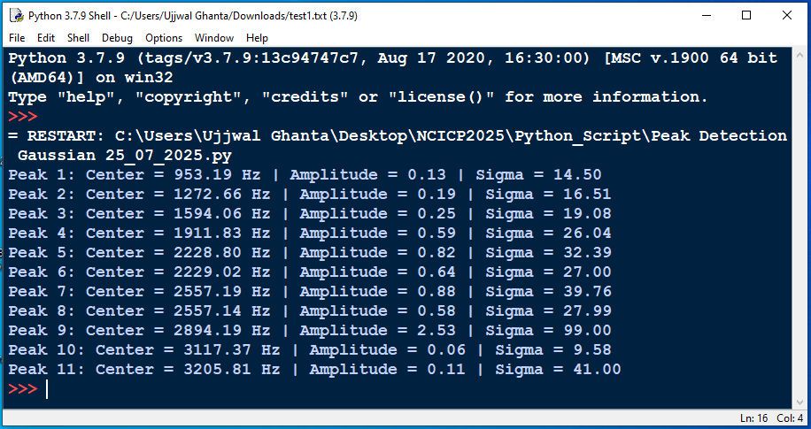

# Resonance Peak Detection in Frequency Response Data

This repository contains two Python scripts for detecting resonance peaks from a frequency response dataset (`Res2.csv`). The dataset is expected to consist of two columns: **Frequency (Hz)** and **Amplitude (Volt)**.

## 📁 Files

### 1. `Peak Detection_Resonance 25_07_2025.py`

Detects local maxima (peaks) using the `scipy.signal.find_peaks` method.

- **Approach**: Local maximum detection based on peak prominence and distance threshold.
- **Visualization**: Plots the original spectrum with detected peaks highlighted.
- **Customization**:
  - You can adjust `prominence` and `distance` parameters to fine-tune peak sensitivity.

### 2. `Peak Detection Gaussian 25_07_2025.py`

Detects peaks and fits each one with a constrained **Gaussian curve** for better precision.

- **Approach**:
  - Detects peaks using `find_peaks`.
  - Applies bounded Gaussian fitting using `scipy.optimize.curve_fit`.
- **Outputs**:
  - Gaussian parameters: peak center, amplitude, and width (sigma).
  - Overlays fitted curves on the original spectrum.
- **Resiliency**: Handles fitting failures gracefully with `try/except`.

## 📊 Dataset

The scripts expect a file named `Res2.csv` in the same directory. It should contain:

```
Frequency (Hz), Amplitude (Volt)
```

## 📦 Dependencies

- numpy
- pandas
- scipy
- matplotlib

Install them using:

```bash
pip install numpy pandas scipy matplotlib
```

## 🔍 Use Cases

- Identifying resonant frequencies in signal processing or mechanical systems.
- Comparing simple peak detection with more precise model-based curve fitting.

---

## 📈 Example Output

Both scripts will produce annotated plots showing detected peaks. The Gaussian version also prints fitted parameters to the console.


- **Gaussian Fit Results**:


---

## 🔧 Future Enhancements

- Add support for batch processing multiple datasets.
- Export fitted parameters to CSV.
- Interactive visualization with `Plotly`.

---

## 📄 License

This project is open-source under the GNU General Public License v2.0 (GPL-2.0).
